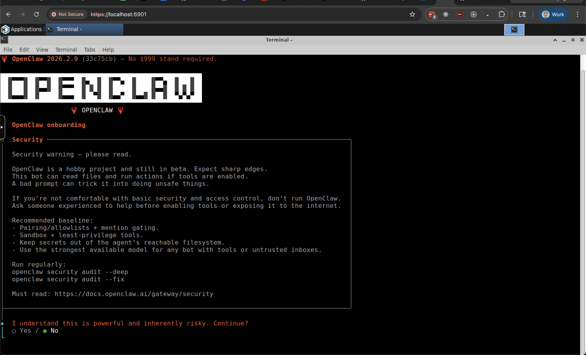

# ClawBot Hosting

Browser-accessible cloud desktops with ClawBot pre-installed. Each customer gets an isolated KasmVNC container behind HTTPS, provisioned automatically via Stripe.



## Architecture

```
Customer browser
    │
    ▼
Caddy (HTTPS, auto-certs)
    │
    ├── alice.example.com  →  clawbot-alice:6901
    ├── bob.example.com    →  clawbot-bob:6901
    └── admin.example.com  →  clawbot-webhook:5000
```

- **Base image:** KasmVNC Ubuntu desktop + ClawBot (`Dockerfile`)
- **Reverse proxy:** Caddy with Docker label discovery — auto-HTTPS per subdomain
- **Isolation:** Each customer runs on its own Docker network
- **Persistence:** Named volumes at `/home/kasm-user` survive restarts and updates
- **Billing:** Stripe Checkout → webhook → auto-provision/deprovision

## Local Development

Run a single desktop container locally — no Stripe, Cloudflare, or domain needed.

```bash
# Build and start
docker compose up --build

# Open in browser
open http://localhost:6901
```

Log in with password `changeme`. This uses `docker-compose.yml` which runs one container with ports exposed directly.

### Testing the webhook service locally

To test the full signup flow without deploying:

```bash
# 1. Install the Stripe CLI: https://docs.stripe.com/stripe-cli
# 2. Start the webhook service
cp .env.example .env
# Fill in STRIPE_SECRET_KEY, STRIPE_PRICE_ID (test mode keys)
docker network create clawbot_net
docker compose -f docker-compose.webhook.yml up --build

# 3. Forward Stripe events to your local webhook
stripe listen --forward-to localhost:5000/webhook
# Copy the webhook signing secret (whsec_...) into .env as STRIPE_WEBHOOK_SECRET
# Restart the webhook service

# 4. Open http://localhost:5000 and test the checkout flow
```

## Production Deployment

### Prerequisites

- Docker + Docker Compose
- `jq` installed on the host
- A domain with DNS on Cloudflare
- A Stripe account with a Product/Price created

### 1. Configure

```bash
cp .env.example .env
# Fill in: SERVER_IP, CLOUDFLARE_API_TOKEN, CLOUDFLARE_ZONE_ID,
#          STRIPE_SECRET_KEY, STRIPE_WEBHOOK_SECRET, STRIPE_PRICE_ID,
#          ADMIN_API_KEY
```

### 2. Build the desktop image

```bash
docker compose build
```

### 3. Start services

```bash
# Start Caddy reverse proxy
docker compose -f docker-compose.caddy.yml up -d

# Start the signup/webhook service
docker compose -f docker-compose.webhook.yml up -d
```

### 4. Configure Stripe webhook

In the Stripe dashboard, add a webhook endpoint:
- **URL:** `https://admin.<your-domain>/webhook`
- **Events:** `checkout.session.completed`, `customer.subscription.deleted`, `invoice.payment_failed`

## Customer Lifecycle

| Event | What Happens |
|-------|-------------|
| Customer signs up at `admin.example.com` | Picks subdomain → Stripe Checkout |
| Payment succeeds | Webhook provisions container + DNS + DB record |
| Customer cancels subscription | Webhook deprovisions container + DNS cleanup |
| Payment fails | Status updated in DB, container stays running |

## Admin CLI

```bash
# Provision manually
./scripts/clawbot-admin provision alice

# List all customers
./scripts/clawbot-admin list

# Check container health
./scripts/clawbot-admin status
./scripts/clawbot-admin status alice

# Look up a customer record
./scripts/clawbot-admin db-get alice

# Deprovision (removes container, volume, DNS)
./scripts/clawbot-admin deprovision alice

# Deprovision but keep data
./scripts/clawbot-admin deprovision --keep-data alice

# Back up all customer volumes
./scripts/clawbot-admin backup

# Rolling update to a new image
./scripts/clawbot-admin update
./scripts/clawbot-admin update clawbot-desktop:v2
```

## Admin API

The webhook service exposes authenticated endpoints at `admin.<your-domain>`:

```bash
# List customers
curl -H "Authorization: Bearer $ADMIN_API_KEY" https://admin.example.com/admin/customers

# Provision via API
curl -X POST -H "Authorization: Bearer $ADMIN_API_KEY" \
  -d '{"subdomain":"alice"}' https://admin.example.com/admin/provision

# Deprovision via API
curl -X POST -H "Authorization: Bearer $ADMIN_API_KEY" \
  -d '{"subdomain":"alice"}' https://admin.example.com/admin/deprovision
```

## Backups

Automated daily backups via cron:

```bash
# Add to crontab
0 3 * * * /path/to/scripts/backup_all.sh >> /var/log/clawbot-backup.log 2>&1
```

Backups are compressed tarballs stored in `$BACKUP_DIR` (default: `./data/backups/`). Old backups are pruned after `$BACKUP_RETENTION_DAYS` days (default: 7).

## Resource Defaults

| Resource | Default | Env Var |
|----------|---------|---------|
| CPU | 1 core | `CPUS` |
| Memory | 2 GB | `MEMORY` |
| Shared memory | 1 GB | `SHM_SIZE` |

At 2 GB per customer, a 64 GB server supports ~25 concurrent customers.

## Project Structure

```
├── Dockerfile                    # KasmVNC + ClawBot image
├── docker-compose.yml            # Dev/test
├── docker-compose.caddy.yml      # Caddy reverse proxy
├── docker-compose.webhook.yml    # Stripe webhook service
├── .env.example                  # Environment variable template
├── scripts/
│   ├── provision_customer.sh     # Provision container + DNS + DB
│   ├── deprovision_customer.sh   # Tear down container + DNS + DB
│   ├── backup_all.sh             # Volume backups
│   ├── rolling_update.sh         # Image update across all containers
│   ├── clawbot-admin             # Admin CLI
│   └── lib/
│       ├── db.sh                 # Customer JSON database helpers
│       └── cloudflare.sh         # Cloudflare DNS API helpers
├── webhook/
│   ├── Dockerfile                # Python Flask service
│   ├── app.py                    # Webhook handler + signup flow
│   ├── requirements.txt
│   └── templates/
│       ├── index.html            # Landing/signup page
│       └── success.html          # Post-checkout credentials
└── data/
    └── customers.json            # Customer database (created at runtime)
```
